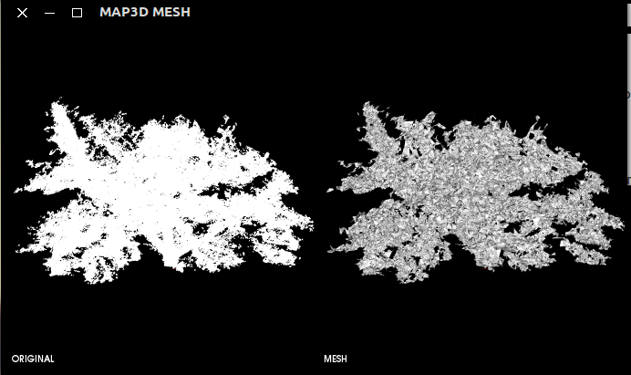

# pointcloudToMesh
C++ application to convert pcd file, ply file, txt file or xyz point cloud to MESH representation (POISSON RECONSTRUCTION). 

-------------------
## Example
 

## Compile
* Set "YOUR" PCL Build DIR in CMakeList.txt e.g: /opt/pcl-1.8.1/build
* Create a "build" folder

in the main folder:

    - cd build  
    - cmake ../src/
    - make
       
        	 
### Test

    ./pointcloudToMESH <ply file> -o <output dir>
    ./pointcloudToMESH <pcd file> -o <output dir>
    ./pointcloudToMESH <txt file> -o <output dir>
    ./pointcloudToMESH <xyz file> -o <output dir>

